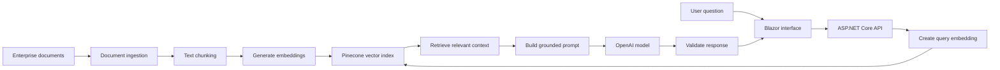
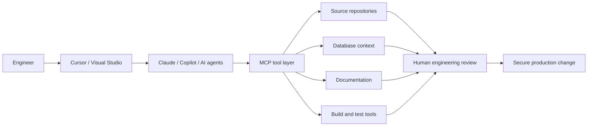
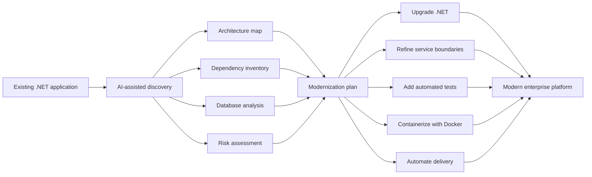
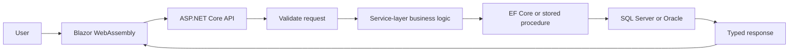
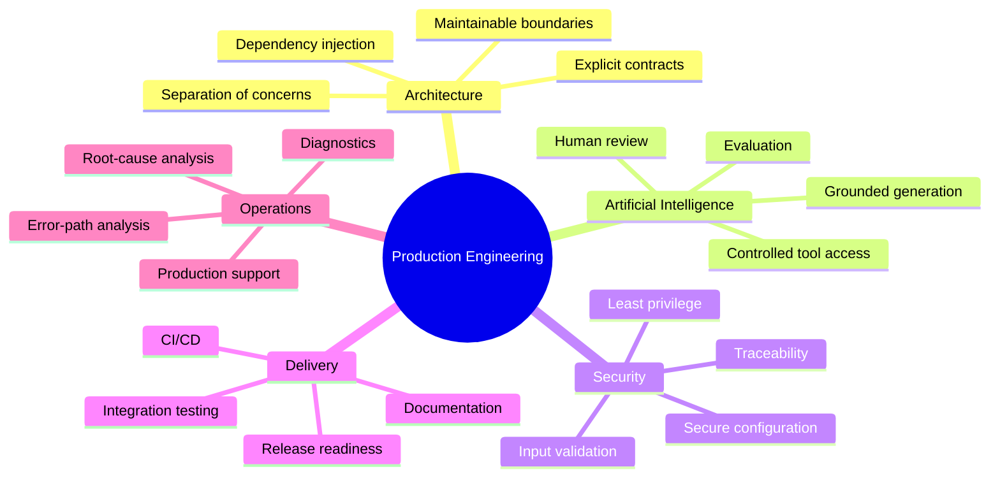

<!--
  ============================================================
  MATTHEW SMITH — AI-NATIVE .NET ENGINEER
  GitHub Profile README
  ============================================================

  Replace every YOUR_GITHUB_USERNAME value if any are added later.
-->

<div align="center">


<br/>

<a href="https://matthewsmithsoftware.com">
  
</a>
<a href="https://linkedin.com/in/mattmarcussmith">
  
</a>
<a href="mailto:matt.marcus.smith@gmail.com">
  
</a>

<br/><br/>


<br/><br/>


</div>

---

## `01 // SYSTEM.IDENTITY`

<div align="center">


</div>

```csharp
var matthew = new Engineer
{
    Name = "Matthew Smith",
    Role = "Full-Stack .NET Software Engineer",

    ProductionStack =
    [
        "C#",
        ".NET 6 and .NET 8",
        "ASP.NET Core Web API",
        "Blazor WebAssembly",
        "Entity Framework Core",
        "SQL Server",
        "Oracle SQL",
        "Backend Microservices",
        "Docker",
        "Azure DevOps"
    ],

    AppliedAI =
    [
        "OpenAI",
        "Retrieval-Augmented Generation",
        "Text Embeddings",
        "Pinecone Vector Search",
        "Enterprise Knowledge Assistants"
    ],

    EngineeringMode =
        "Modernize deliberately. Automate responsibly. Ship securely."
};
```

<table>
<tr>
<td width="25%" align="center" valign="top">

### Backend

ASP.NET Core
REST APIs
Microservices
Service-layer logic
Stored procedures

</td>
<td width="25%" align="center" valign="top">

### Full Stack

Blazor WebAssembly
Razor components
Telerik UI
DTO contracts
Validation workflows

</td>
<td width="25%" align="center" valign="top">

### Applied AI

OpenAI
Embeddings
Pinecone
RAG pipelines
Knowledge assistants

</td>
<td width="25%" align="center" valign="top">

### Delivery

Docker
Azure DevOps
CI/CD
IIS
Agile and SAFe

</td>
</tr>
</table>

---

## `02 // FEATURED AI SYSTEMS`

<div align="center">


<br/>


</div>

<br/>

<table>
<tr>
<td width="50%" valign="top">

<div align="center">

### AI-Powered HR Knowledge Assistant


</div>

A self-service enterprise assistant developed with:

* C# and .NET
* ASP.NET Core
* OpenAI API
* Text embeddings
* Pinecone vector search
* Retrieval-Augmented Generation

The assistant delivered grounded answers covering:

* Vacation and sick leave
* Retirement benefits
* Payroll
* Employee eligibility
* Enrollment
* HR policies

<div align="center">


</div>

</td>
<td width="50%" valign="top">

<div align="center">

### Joint Travel Regulations Assistant


</div>

A context-aware policy assistant developed with:

* Blazor WebAssembly
* ASP.NET Core
* C#
* OpenAI API
* Text embeddings
* Pinecone vector search
* Retrieval-Augmented Generation

The assistant provided guidance covering:

* Per diem
* Lodging
* Transportation
* Reimbursements
* Allowances
* Official travel policies

<div align="center">


</div>

</td>
</tr>
</table>

---

## `03 // RAG ARCHITECTURE`

<div align="center">


</div>



<div align="center">


</div>

---

## `04 // AI ENGINEERING COCKPIT`

<div align="center">


<br/>


</div>

<br/>

<table>
<tr>
<td width="25%" valign="top" align="center">

### Cursor

Repository-aware development

Multi-file implementation

Contextual refactoring

Project rules and instructions

</td>
<td width="25%" valign="top" align="center">

### Claude

Architecture analysis

Codebase reasoning

Modernization planning

Technical documentation

</td>
<td width="25%" valign="top" align="center">

### Copilot

Inline assistance

Agent-driven implementation

Test generation

Pull-request workflows

</td>
<td width="25%" valign="top" align="center">

### MCP

Repository tools

Database context

Documentation retrieval

Controlled agent actions

</td>
</tr>
</table>



<div align="center">

> AI accelerates the engineering loop. It does not replace architectural judgment, testing, security review, or accountability.

</div>

---

## `05 // MODERNIZATION ENGINE`

<div align="center">


</div>



<table>
<tr>
<td width="33%" valign="top">

### Discover

* Repository exploration
* Dependency mapping
* Stored-procedure analysis
* API integration discovery
* Error-path identification
* Acceptance-criteria traceability

</td>
<td width="33%" valign="top">

### Modernize

* Current .NET adoption
* Service-layer refinement
* API boundary extraction
* Validation standardization
* Docker environments
* Maintainable architecture

</td>
<td width="33%" valign="top">

### Operationalize

* Integration testing
* Release-readiness checks
* Production diagnostics
* Root-cause analysis
* CI/CD automation
* Secure coding practices

</td>
</tr>
</table>

---

## `06 // PRODUCTION STACK`

<div align="center">


<br/>


<br/><br/>


<br/>


</div>

---

## `07 // APPLICATION REQUEST FLOW`

<div align="center">


</div>



<div align="center">


</div>

---

## `08 // EXPERIENCE SIGNAL`

<div align="center">


</div>

```text
2023 ───────────────────────────────────────────────────────────── 2026+

Bosch Automotive              VSolvit Full Stack              VSolvit Backend
Application Developer         .NET Engineer                   .NET Engineer II
Intern

Greenfield C#                 Blazor + ASP.NET Core           Backend microservices
WebAssembly help desk         AI and RAG assistants           Oracle SQL
API documentation             EF Core + SQL Server            Stored procedures
Support workflows             Docker development              Production support
```

<div align="center">


</div>

---

## `09 // ENGINEERING PRINCIPLES`

<div align="center">


</div>



<div align="center">

> **AI-generated code must meet the same standards as human-written production code.**


</div>

---

## `10 // EDUCATION + CERTIFICATIONS`

<div align="center">


<table>
<tr>
<td width="50%" align="center">

### Master of Science

**Software Engineering**

Western Governors University
2024–2026

</td>
<td width="50%" align="center">

### Bachelor of Science

**Software Engineering**

Western Governors University
2022–2024

</td>
</tr>
</table>


</div>

---

## `11 // CURRENT ENGINEERING DIRECTION`

<div align="center">


<br/>

<table>
<tr>
<td width="33%" align="center" valign="top">

### AI-Native .NET

Integrating models, retrieval, agents, structured outputs, and tool calling into enterprise applications.

</td>
<td width="33%" align="center" valign="top">

### Application Modernization

Analyzing existing systems, reducing technical debt, upgrading architecture, and containerizing workloads.

</td>
<td width="33%" align="center" valign="top">

### Agentic Engineering

Connecting Cursor, Claude, Copilot, MCP servers, repositories, databases, and delivery tooling.

</td>
</tr>
</table>

</div>

---

<div align="center">


<br/>

### `C# • .NET • AI • RAG • MCP • DOCKER • ENTERPRISE SYSTEMS`


</div>
